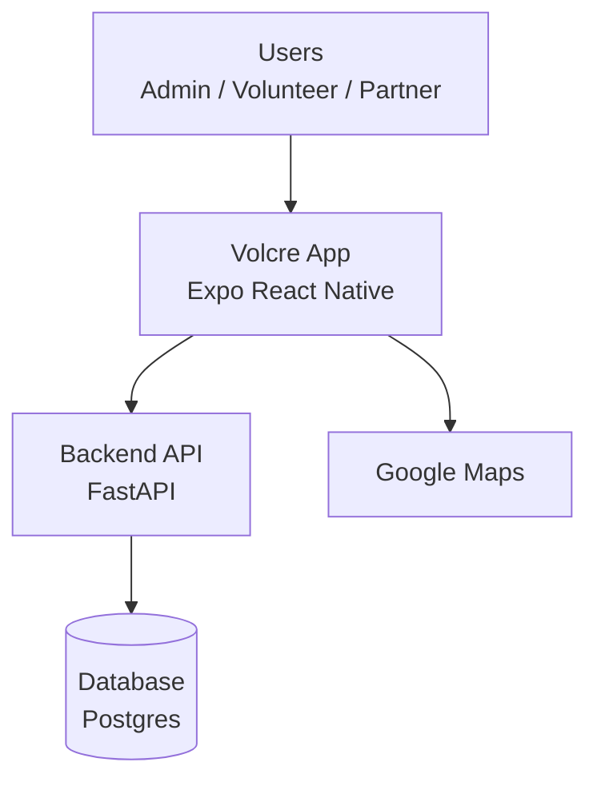

# Volcre Simple System Diagram

## Simple Diagram



## Very Easy Drawing

```text
 +----------------------+
 |        USERS         |
 | Admin Volunteer      |
 | Partner              |
 +----------+-----------+
            |
            v
 +----------------------+
 |      VOLCRE APP      |
 |  Mobile / Web UI     |
 +----------+-----------+
            |
            v
 +----------------------+
 |     BACKEND API      |
 |       FastAPI        |
 +----------+-----------+
            |
            v
 +----------------------+
 |      DATABASE        |
 |      Postgres        |
 +----------------------+

 Volcre App ---> Google Maps
```

## Short Explanation

- Users use the Volcre app.
- The app sends data requests to the backend API.
- The backend API reads and writes data in the database.
- The app also connects to Google Maps for map features.
