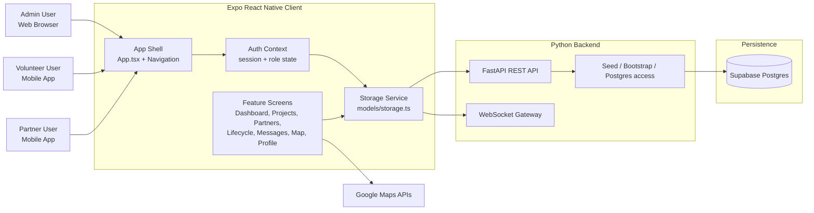
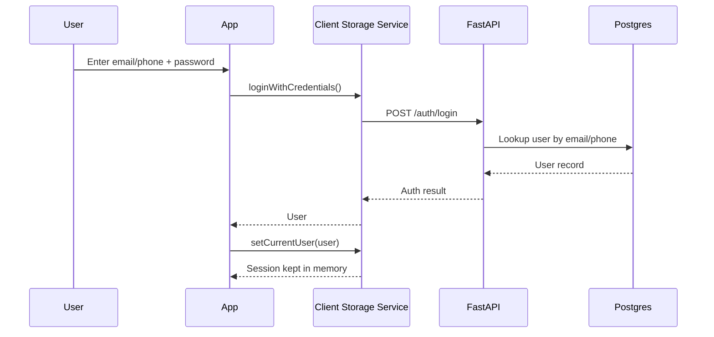
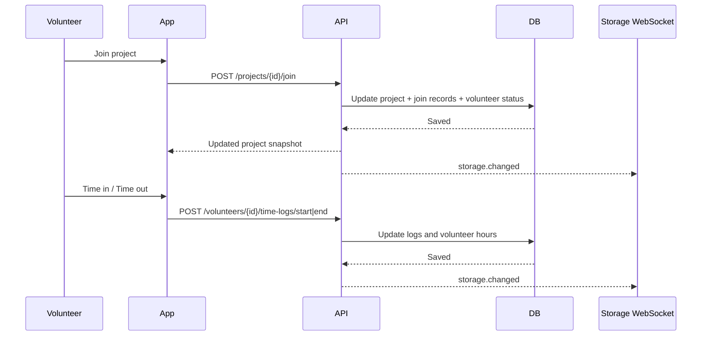
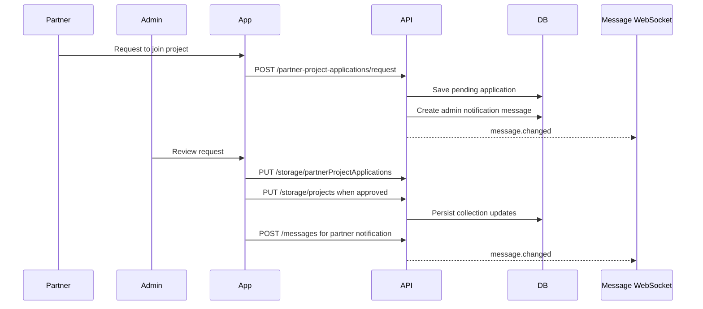
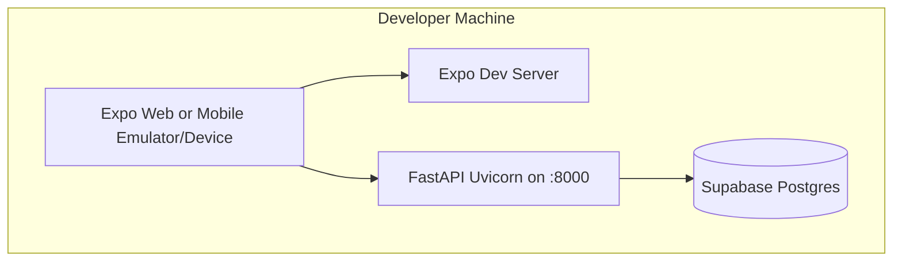

# Volcre System Architecture

## 1. Architecture Summary

Volcre is a multi-role volunteer coordination system built as one Expo React Native application with role-based experiences for:

- Admin users on web
- Volunteers on mobile
- Partner organizations on mobile

The current implementation follows a **rich client + service API** architecture:

- The **Expo app** owns presentation, navigation, role gating, and part of the workflow orchestration.
- A **FastAPI backend** provides authentication lookup, shared data access, workflow endpoints, and real-time notifications.
- **PostgreSQL (Supabase)** is the single system of record.
- Client session state is **memory-only**. After a refresh or app restart, the user must log in again.

## 2. High-Level Container View

## 3. Frontend Architecture

### 3.1 Application Shell

- [`App.tsx`](/c:/Users/ACER/OneDrive/Desktop/volunteer%20system2/volunteer-system/App.tsx) initializes:
  - `SafeAreaProvider`
  - `AuthProvider`
  - `NavigationContainer`
- [`navigation/StackNavigator.tsx`](/c:/Users/ACER/OneDrive/Desktop/volunteer%20system2/volunteer-system/navigation/StackNavigator.tsx) switches between login and main application flows.
- [`navigation/TabNavigator.tsx`](/c:/Users/ACER/OneDrive/Desktop/volunteer%20system2/volunteer-system/navigation/TabNavigator.tsx) exposes screens based on role.

### 3.2 Auth and Session

- [`contexts/AuthContext.tsx`](/c:/Users/ACER/OneDrive/Desktop/volunteer%20system2/volunteer-system/contexts/AuthContext.tsx) manages:
  - signed-in user
  - loading state
  - login/logout
  - role flags
- Web access is still restricted in the client:
  - admin allowed on web
  - volunteer and partner blocked on web
- `currentUser` is stored only in process memory through [`models/storage.ts`](/c:/Users/ACER/OneDrive/Desktop/volunteer%20system2/volunteer-system/models/storage.ts).
- Result: refresh/restart clears the session.

### 3.3 Client Domain Layer

[`models/storage.ts`](/c:/Users/ACER/OneDrive/Desktop/volunteer%20system2/volunteer-system/models/storage.ts) is the client gateway layer. It is responsible for:

- resolving API base URLs from Expo config
- reading and writing shared data through the backend
- keeping `currentUser` in memory
- exposing domain operations for screens
- opening WebSocket subscriptions for:
  - storage changes
  - messaging events
- bootstrapping demo data into the backend

### 3.4 UI Modules

Main screen groups:

- Admin:
  - Dashboard
  - Partner onboarding review
  - Project lifecycle
  - Volunteer management
  - User management
  - System settings
- Volunteer:
  - Dashboard
  - Projects
  - Messaging
  - Profile
- Partner:
  - Dashboard
  - Partner onboarding
  - Projects
  - Messaging
  - Profile
- Shared:
  - Mapping

## 4. Backend Architecture

### 4.1 Service Layer

[`backend/api.py`](/c:/Users/ACER/OneDrive/Desktop/volunteer%20system2/volunteer-system/backend/api.py) provides:

- health and DB status endpoints
- login and user lookup endpoints
- project snapshot and workflow endpoints
- messaging endpoints
- generic shared storage endpoints
- WebSocket endpoints for real-time updates

The backend uses two API styles:

- **Domain endpoints**
  - `/auth/login`
  - `/projects/snapshot`
  - `/projects/{project_id}/join`
  - `/volunteers/{volunteer_id}/time-logs/start`
  - `/volunteers/{volunteer_id}/time-logs/end`
  - `/partner-project-applications/request`
  - `/messages`
- **Generic storage endpoints**
  - `/storage/{key}`
  - `/storage/batch`
  - `/storage`

### 4.2 Database Connectivity

[`backend/db.py`](/c:/Users/ACER/OneDrive/Desktop/volunteer%20system2/volunteer-system/backend/db.py) now supports **Postgres only**.

Behavior:

- `SUPABASE_DB_URL` must be configured.
- The backend probes Postgres availability.
- If Postgres is unavailable, backend data endpoints return errors instead of falling back to another database.

### 4.3 Seeding and Hot Storage

[`backend/app_storage_seed.py`](/c:/Users/ACER/OneDrive/Desktop/volunteer%20system2/volunteer-system/backend/app_storage_seed.py) seeds demo data into Postgres and manages two persistence patterns:

- `app_storage`
  - generic key/value JSON storage
- hot storage tables
  - `app_users_store`
  - `app_partners_store`
  - `app_projects_store`
  - `app_volunteers_store`
  - `app_status_updates_store`
  - `app_volunteer_matches_store`
  - `app_volunteer_time_logs_store`
  - `app_volunteer_project_joins_store`
  - `app_partner_project_applications_store`

Hot storage is used for frequently-accessed list domains so records can be updated individually while still matching the app's collection-based model.

### 4.4 Real-Time Layer

The backend maintains in-memory WebSocket connection registries for:

- per-user message events at `/ws/messages/{user_id}`
- storage invalidation events at `/ws/storage`

This is used to push:

- `message.changed`
- `storage.changed`

The frontend also falls back to polling if storage WebSockets disconnect.

## 5. Data Architecture

### 5.1 Core Business Entities

Defined in [`models/types.ts`](/c:/Users/ACER/OneDrive/Desktop/volunteer%20system2/volunteer-system/models/types.ts):

- `User`
- `Partner`
- `Project`
- `Volunteer`
- `StatusUpdate`
- `Message`
- `VolunteerProjectMatch`
- `VolunteerTimeLog`
- `VolunteerProjectJoinRecord`
- `PartnerProjectApplication`
- `SectorNeed`

### 5.2 Data Ownership

| Data | Primary owner | Persistence |
|---|---|---|
| Session (`currentUser`) | Client | in-memory only |
| Shared users/partners/projects/volunteers | Backend API | Postgres |
| Messages | Backend API | Postgres `messages` table |
| Map configuration | Expo config / environment | runtime config |
| Demo seed data | Backend seed scripts and client bootstrap helpers | Postgres |

### 5.3 Persistence Pattern

The current system mixes two approaches:

- **Record-oriented backend operations**
  - message insert/update
  - join project
  - start/end time log
  - partner project join request
- **Collection replacement**
  - many client updates still read a whole collection, modify it in memory, and write it back through `/storage/{key}`

That means the single source of truth is centralized in Postgres, but not all business rules are centralized in the backend yet.

## 6. Key Runtime Flows

### 6.1 Authentication Flow

### 6.2 Volunteer Project Join and Time Logging

### 6.3 Partner Request and Admin Review

### 6.4 Messaging Flow

- Client loads conversation history through REST.
- Client subscribes to `/ws/messages/{userId}`.
- Backend persists new messages, then broadcasts to sender and recipient.
- Message unread badges are recalculated in the client.

## 7. Deployment View

### 7.1 Current Development Deployment

Notes:

- [`app.config.js`](/c:/Users/ACER/OneDrive/Desktop/volunteer%20system2/volunteer-system/app.config.js) can auto-start the backend in local development.
- The Expo config injects:
  - `apiBaseUrl`
  - `webApiBaseUrl`
  - Google Maps keys

### 7.2 Production Topology

Production should follow the same logical shape:

- Expo web build for admin users
- mobile app build for volunteers and partners
- FastAPI as a hosted backend service
- Supabase Postgres as the only persistent database
- environment-managed API base URLs and Maps keys

## 8. Architectural Strengths

- One codebase supports web admin and mobile users.
- Postgres is the single source of truth.
- The backend already supports real-time messaging and storage invalidation.
- Postgres is separated from the client, which is the correct security boundary.
- Hot storage tables give better structure than pure key/value blobs.

## 9. Current Architectural Risks

- Business rules are still split between frontend and backend.
- Many write operations still replace whole collections instead of using record-level APIs.
- Role enforcement is primarily client-side for platform restrictions.
- No evidence of token-based auth or server-side authorization boundaries.
- WebSocket connection state is in-memory, so horizontal scaling would require shared pub/sub.
- Session state is not persistent across refresh or app restart.

## 10. Suggested Next Architecture Step

The clean next step is to move from **client-orchestrated shared storage** to **backend-owned domain services**:

- keep `models/storage.ts` as a client gateway
- replace generic collection writes with domain APIs
- add server-side auth and authorization
- add token/session persistence if persistent sign-in is required
- keep Postgres as the only source of truth

## 11. Recommended Module Boundaries

If you want to evolve this system further, use these ownership boundaries:

- **Client presentation**
  - screens, navigation, local UI state
- **Client gateway**
  - API calls, subscriptions, DTO mapping
- **Backend domain services**
  - auth, projects, volunteers, partners, messaging, reporting
- **Persistence**
  - Postgres tables and repository/query layer
- **Integration layer**
  - WebSocket broadcast, Maps integration, seed/bootstrap jobs

## 12. Reference Files

- [`App.tsx`](/c:/Users/ACER/OneDrive/Desktop/volunteer%20system2/volunteer-system/App.tsx)
- [`contexts/AuthContext.tsx`](/c:/Users/ACER/OneDrive/Desktop/volunteer%20system2/volunteer-system/contexts/AuthContext.tsx)
- [`navigation/StackNavigator.tsx`](/c:/Users/ACER/OneDrive/Desktop/volunteer%20system2/volunteer-system/navigation/StackNavigator.tsx)
- [`navigation/TabNavigator.tsx`](/c:/Users/ACER/OneDrive/Desktop/volunteer%20system2/volunteer-system/navigation/TabNavigator.tsx)
- [`models/storage.ts`](/c:/Users/ACER/OneDrive/Desktop/volunteer%20system2/volunteer-system/models/storage.ts)
- [`models/types.ts`](/c:/Users/ACER/OneDrive/Desktop/volunteer%20system2/volunteer-system/models/types.ts)
- [`backend/api.py`](/c:/Users/ACER/OneDrive/Desktop/volunteer%20system2/volunteer-system/backend/api.py)
- [`backend/db.py`](/c:/Users/ACER/OneDrive/Desktop/volunteer%20system2/volunteer-system/backend/db.py)
- [`backend/app_storage_seed.py`](/c:/Users/ACER/OneDrive/Desktop/volunteer%20system2/volunteer-system/backend/app_storage_seed.py)
- [`app.config.js`](/c:/Users/ACER/OneDrive/Desktop/volunteer%20system2/volunteer-system/app.config.js)
